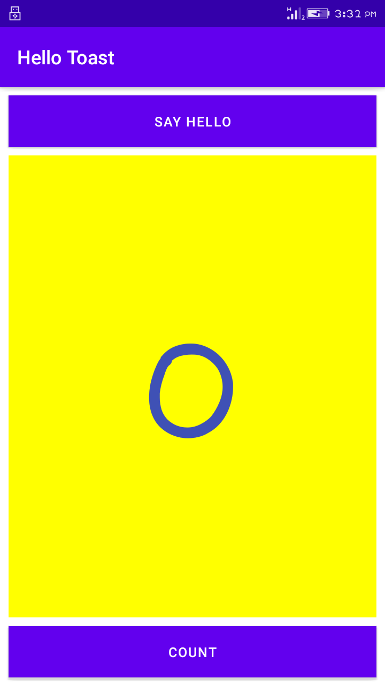
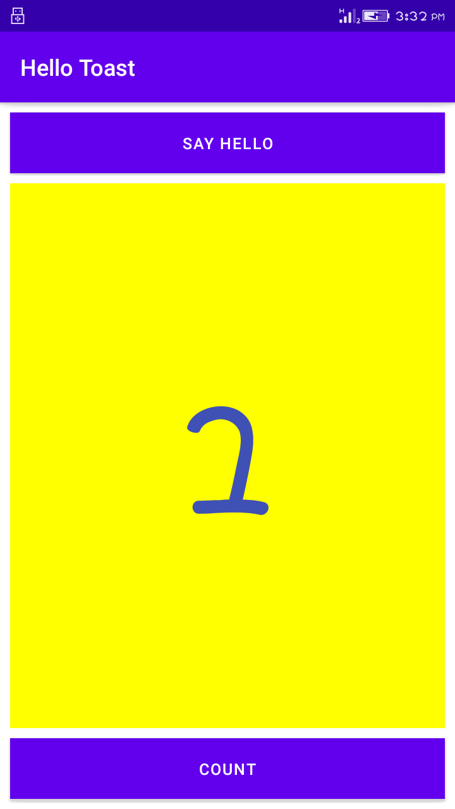
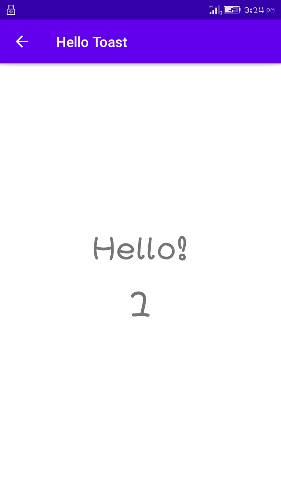

# Lab Work 4
## Activities-and-intents (Homework)

**This is the fourth lab Exercise "Activities-and-intents" with two Button and One textview in first activity and two textView in second activity, as this readme file consist of the screenshot and video i.e. gif file for the final app created**

### HomePage UI

**The above screenshot show the home page of the app as count button help to increase the counter value and say hello button when clicked it will redirect to second activity**

### Count Button is Clicked

**The above screenshot show the increase value of textview when count button is clicked**

### Say hello Button is clicked

**The above screenshot show second activity when say hello button is clicked**

### Working functionality of App

**The above record show the whole working functionality of app.The UI Consist of two activity i.e.Two 
pages with three different views; 2 button views and 3 text view. The 'SayHello' button is used to 
display the count value in next page while the 'Count' button is used to increase the count value 
when pressed. Similarly, the text view at the center is used to display the current count value and the
counter value in the second page**