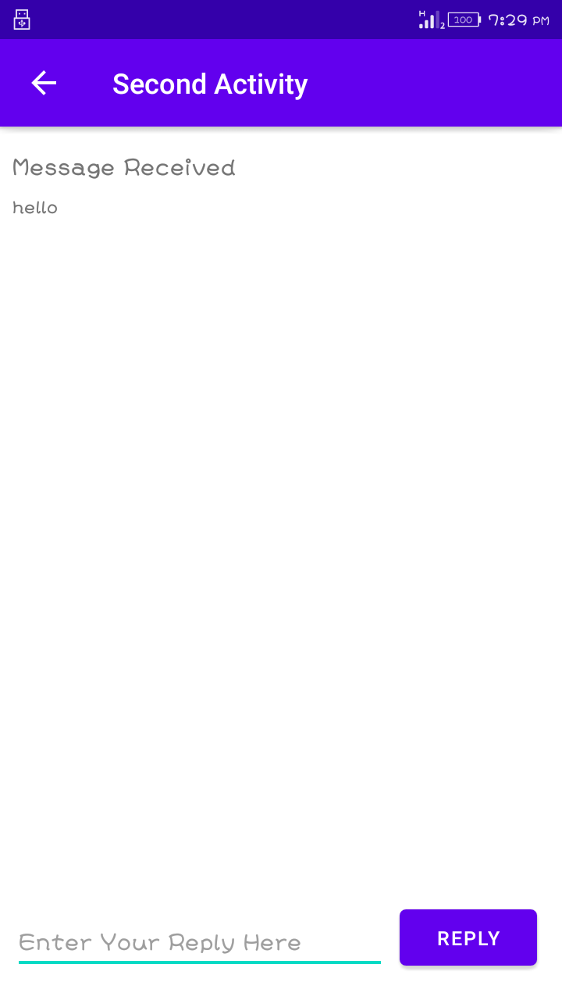
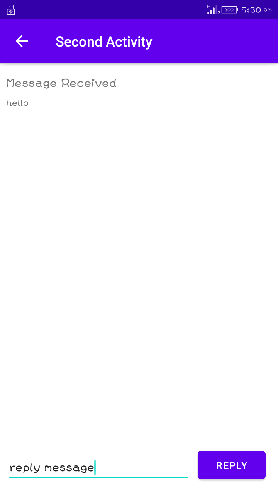
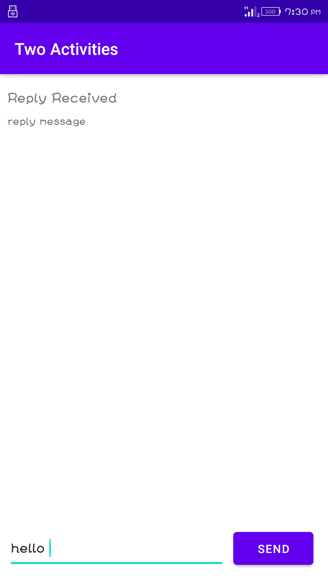
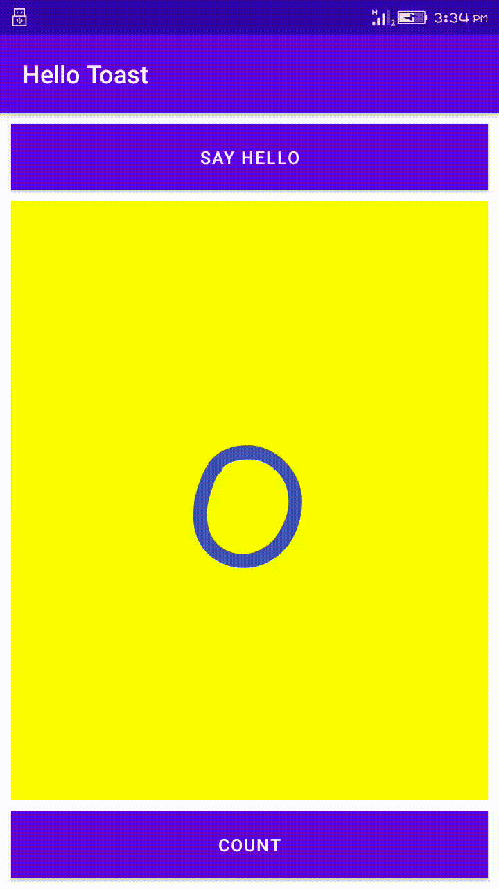

# Lab Work 4
## Activities-and-intents

**This is the fourth lab Exercise "Activities-and-intents" with two textView ,Button and Edittext as this readme file consist of the screenshot and
video i.e. gif file for the final app created**

### Landing Page UI

**The above screenshot show the home page consist of two textview ,one edittext and one button**

### Write Message in EditText

**The above screenshot show message written in editText that is about to be send**

### Send Button is Clicked

**The above screenshot show when the button is clicked then second activity will display with insert message in textview**

### reply from second activity

**The above screenshot show the message written in second activity**

### After reply button Click

**The above screenshot show when the reply button is clicked then first activity will display with reply message in textview**

### Working of Application

**The above video show the working process of application. The UI consist of two Activity i.e.Two pages.
Each page contain two textView,One button and one EditText. textview for display the text that is get from another page,
button help to pass the data to next page and Edittext where we store a text message to be passed.**
