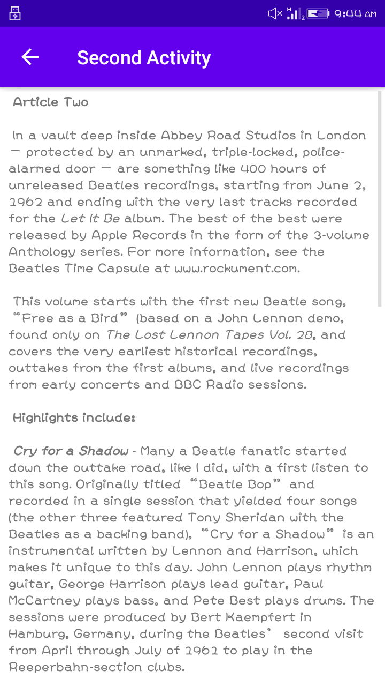
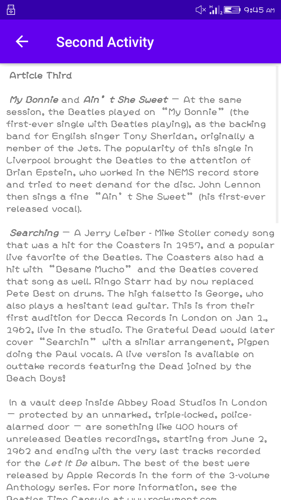

# Lab Work 4
## Activities-and-intents (Coding Challenge)

**This is the fourth lab Exercise "Activities-and-intents" with three Button at first activity and textView in second activity, as this readme file consist of the screenshot and video i.e. gif file for the final app created**

### Home Page UI

**The above screenshot show the front Page with three button to show related article in second activity**

### First Button Is Clicked

**The above screenshot shows the first article display in second page**

### Second Button Is Clicked

**The above screenshot shows the second article display in second page**

### Third Button Is Clicked

**The above screenshot shows the third article display in second page**

### Working Process of Application

**The above record show the full functionality of app.It consist of two pages at first page it contain three
button and second page consist of three textView .If the text_one button is clicked then it display article first and 
if the user clicked second button then it will display second article and like wise for button third**